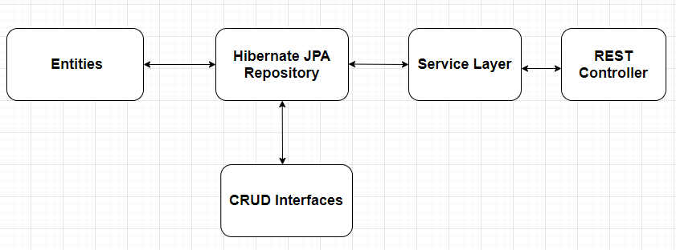

The backend is bootstrapped by Spring Boot and ORM is bootstrapped by MySQL database. Make sure your machine powers Java 8 or higher.
There is another Node.js version in the client repository. Make sure you have Node.js installed.

## Available Scripts

In the project directory, run the `main` method to boost the server. 

## Architecture

The backend follows typical MVC design pattern. Following layers are developed in order: Entity to define the model, JPA interface for CRUD manipulation, service layer and rest controller with injected service component. A schematic representation is shown in this figure. 

## REST API List

We develop the following REST API for CRUD methods.

